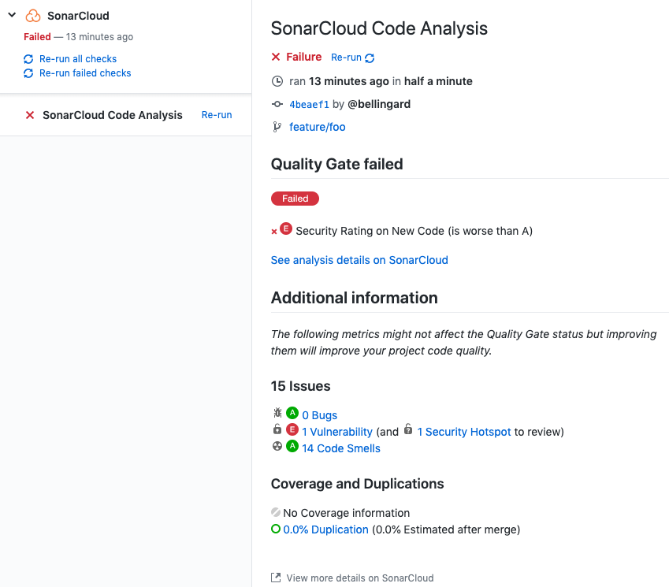

# Analyze your code for free with SonarCloud

This SonarSource project, available as a GitHub Action, scans your projects with SonarCloud, and helps developers produce 
[Clean Code](https://www.sonarsource.com/solutions/clean-code/?utm_medium=referral&utm_source=github&utm_campaign=clean-code&utm_content=sonarqube-scan-action).


[SonarCloud](https://www.sonarsource.com/products/sonarcloud/) is a widely used static analysis solution for continuous code quality and security inspection. 
It helps developers identify and fix issues in their code that could lead to bugs, vulnerabilities, or decreased development velocity.
SonarCloud supports the most popular programming languages, including Java, JavaScript, TypeScript, C#, Python, C, C++, and [many more](https://www.sonarsource.com/knowledge/languages/).

## Requirements

* Create your account on SonarCloud. Sign up for free now if it's not already the case! [SonarCloud Sign up](https://www.sonarsource.com/products/sonarcloud/signup/?utm_medium=referral&utm_source=github&utm_campaign=sc-signup&utm_content=signup-sonarcloud-listing-x-x&utm_term=ww-psp-x)
* The repository to analyze is set up on SonarCloud. [Set it up](https://sonarcloud.io/projects/create) in just one click.

## Usage

Project metadata, including the location of the sources to be analyzed, must be declared in the file `sonar-project.properties` in the base directory:

```properties
sonar.organization=<replace with your SonarCloud organization key>
sonar.projectKey=<replace with the key generated when setting up the project on SonarCloud>

# relative paths to source directories. More details and properties are described
# in https://sonarcloud.io/documentation/project-administration/narrowing-the-focus/
sonar.sources=.
```

The workflow, usually declared in `.github/workflows/build.yml`, looks like:

```yaml
on:
  # Trigger analysis when pushing in master or pull requests, and when creating
  # a pull request.
  push:
    branches:
      - master
  pull_request:
      types: [opened, synchronize, reopened]
name: Main Workflow
jobs:
  sonarcloud:
    runs-on: ubuntu-latest
    steps:
    - uses: actions/checkout@v4
      with:
        # Disabling shallow clone is recommended for improving relevancy of reporting
        fetch-depth: 0
    - name: SonarCloud Scan
      uses: sonarsource/sonarcloud-github-action@<action version> # Ex: v2.1.0, See the latest version at https://github.com/marketplace/actions/sonarcloud-scan
      env:
        SONAR_TOKEN: ${{ secrets.SONAR_TOKEN }}
```

You can change the analysis base directory by using the optional input `projectBaseDir` like this:

```yaml
uses: sonarsource/sonarcloud-github-action@<action version> # Ex: v2.1.0, See the latest version at https://github.com/marketplace/actions/sonarcloud-scan
with:
  projectBaseDir: my-custom-directory
```

In case you need to add additional analysis parameters, you can use the `args` option:

```yaml
- name: Analyze with SonarCloud
  uses: sonarsource/sonarcloud-github-action@<action version> # Ex: v2.1.0, See the latest version at https://github.com/marketplace/actions/sonarcloud-scan
  with:
    projectBaseDir: my-custom-directory
    args: >
      -Dsonar.organization=my-organization
      -Dsonar.projectKey=my-projectkey
      -Dsonar.python.coverage.reportPaths=coverage.xml
      -Dsonar.sources=lib/
      -Dsonar.test.exclusions=tests/**
      -Dsonar.tests=tests/
      -Dsonar.verbose=true
```

More information about possible analysis parameters is found in the documentation at:
https://docs.sonarcloud.io/advanced-setup/analysis-parameters

In case you need to specify the version of the Sonar Scanner, you can use the `scannerVersion` option:

```yaml
uses: sonarsource/sonarcloud-github-action@<action version> # Ex: v2.1.0, See the latest version at https://github.com/marketplace/actions/sonarcloud-scan
with:
  scannerVersion: 6.2.0.4584
```

See also example configurations at:
https://github.com/sonarsource/sonarcloud-github-action-samples/

### Secrets

- `SONAR_TOKEN` – **Required** this is the token used to authenticate access to SonarCloud. You can generate a token on your [Security page in SonarCloud](https://sonarcloud.io/account/security/). You can set the `SONAR_TOKEN` environment variable in the "Secrets" settings page of your repository.
- *`GITHUB_TOKEN` – Provided by Github (see [Authenticating with the GITHUB_TOKEN](https://help.github.com/en/actions/automating-your-workflow-with-github-actions/authenticating-with-the-github_token)).*

## Error cleaning up workspace

In some cases, the checkout action may fail to clean up the workspace. This is a known problem for GitHub actions implemented as a docker container (such as `sonarcloud-github-actions`) when self-hosted runners are used. 
Example of the error message: `File was unable to be removed Error: EACCES: permission denied, unlink '/actions-runner/_work//project/.scannerwork/.sonar_lock'`
To work around the problem, `sonarcloud-github-action` attempts to fix the permission of the temporary files that it creates. If that doesn't work, you can manually clean up the workspace by running the following action:
```
- name: Clean the workspace
  uses: docker://alpine
  with:
    args: /bin/sh -c "find \"${GITHUB_WORKSPACE}\" -mindepth 1 ! -name . -prune -exec rm -rf {} +"
```
You can find more info [here](https://github.com/actions/runner/issues/434).

## Example of pull request analysis



Want to see more examples of SonarCloud in action? You can [explore current Open Source projects in SonarCloud](https://sonarcloud.io/explore/projects?sort=-analysis_date?utm_medium=referral&utm_source=github&utm_campaign=sc-signup&utm_content=signup-sonarcloud-listing-x-x&utm_term=ww-psp-x) that are using the Clean as You Code methodology.

## Do not use this GitHub action if you are in the following situations

* Your code is built with Maven: run 'org.sonarsource.scanner.maven:sonar' during the build
* Your code is built with Gradle: use the SonarQube plugin for Gradle during the build
* You want to analyze a .NET solution: Follow our interactive tutorial for GitHub Actions after importing your project directly into SonarCloud
* You want to analyze C and C++ code: rely on our [SonarCloud Scan for C and C++](https://github.com/marketplace/actions/sonarcloud-scan-for-c-and-c) and look at [our sample C and C++ project](https://github.com/sonarsource-cfamily-examples?q=gh-actions-sc&type=all&language=&sort=)

## Have questions or feedback?

To provide feedback (requesting a feature or reporting a bug) please post on the [SonarSource Community Forum](https://community.sonarsource.com/) with the tag `sonarcloud`.

## License

Container images built with this project include third-party materials.
